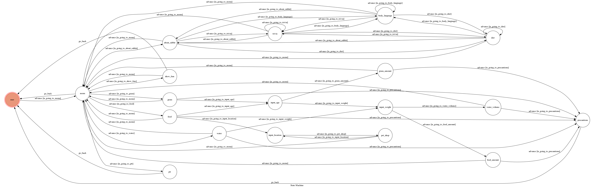

# TOC Project 2020

## 動機

在這個時代，幾乎人人家裡都會養寵物，而在台灣的飼主們的寵物也以養狗或養貓為主，養兔子的人比例其實不多。也因此許多飼主們可能不清楚養兔子的正確觀念，例如各年齡的兔子應該吃什麼樣的草，或是飼料該給多少的量等等，於是由作者我這個現任兔奴來利用這個聊天機器人提供正確的資訊給大家，目的是讓每個家裡的兔兔都能得到好好的照顧 (●°u°●)」  
而這裡除了有告訴你怎麼好好的養一隻兔子之外，也提供了許多有關兔兔的有趣知識，想讓大家去了解哦。  

## 基本資訊

**兔兔小幫手**

**QR code**

**功能選單**

## 功能介紹

### 關於飼料

**兔兔一天飼料量**  
- 輸入兔兔『年齡』、『體重』  
- 可提供兔兔適合吃哪種飼料以及一天的飼料量應為多少  

**飼料沒了可以去哪買**  
- 輸入『地點』  
- 可提供連結搜尋附近寵物店  

**吃飼料的注意事項**
- 兔兔吃飼料時有什麼需要注意的 

 
****

### 關於喝水

**兔兔一天需水量**  
- 輸入兔兔『體重』 
- 可提供兔兔一天的需水量應為多少  

**喝水的注意事項**
- 兔兔喝水時有什麼需要注意的  

****

### 關於吃草

**兔兔適合哪種草**  
- 輸入兔兔『年齡』  
- 可提供兔兔適合吃哪一種草  

**吃草的注意事項**
- 兔兔吃草時有什麼需要注意的  

****

### 兔兔の小知識

**有關兔兔飲食**  
- 提供有關兔兔飲食的知識，e.g.,哪些食物兔子可以吃、哪些食物兔子絕對不能吃  

**兔兔的肢體語言**  
- 兔兔的各種肢體語言所代表的意思，e.g.,兔兔後腳站立是什麼意思  

**兔兔冷知識**  
- 有關兔兔的冷知識，e.g.,世界紀錄中最大隻的兔子有多大  

****

### 看看ptt兔版都在討論什麼

- 可取得`PTT看版rabbit`的**最新前5篇**貼文  

****

### fsm圖片

- show出`fsm圖片`  

如下圖  

****

## Finite State Machine

